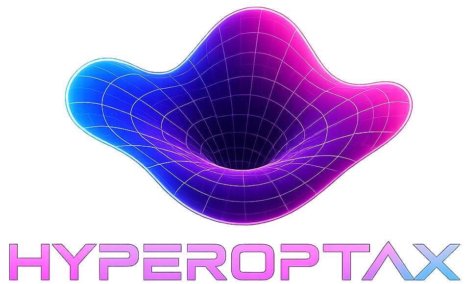

# Hyperoptax: Parallel hyperparameter tuning with JAX

[](https://pypi.org/project/hyperoptax)

[](https://codecov.io/gh/TheodoreWolf/hyperoptax)


## ⛰️ Introduction

Hyperoptax is a lightweight toolbox for parallel hyperparameter optimization of pure JAX functions. It provides a concise API that lets you wrap any JAX-compatible loss or evaluation function and search across spaces __in parallel__  – all while staying in pure JAX.

## 🏗️ Installation

```bash
pip install hyperoptax
```

If you want to use the notebooks:
```bash
pip install hyperoptax[notebooks]
```

If you do not yet have JAX installed, pick the right wheel for your accelerator:

```bash
# CPU-only
pip install --upgrade "jax[cpu]"
# or GPU/TPU – see the official JAX installation guide
```

## 🥜 In a nutshell


All optimizers follow the same stateless pattern: `Optimizer.init` returns a `(state, optimizer)` pair, and `optimizer.optimize` runs the search loop. Your objective function must have the signature `fn(key, params) -> scalar`. Importantly, `params` can be _any_ PyTree.


```python
import jax
from hyperoptax import BayesianSearch, LogSpace, LinearSpace

def train_nn(key, params):
    learning_rate = params["learning_rate"]
    final_lr_pct = params["final_lr_pct"]
    ...
    return val_loss  # scalar, lower is better

search_space = {
    "learning_rate": LogSpace(1e-5, 1e-1),
    "final_lr_pct": LinearSpace(0.01, 0.5),
}

state, optimizer = BayesianSearch.init(
    search_space,
    n_max=100,       # observation buffer size (= number of iterations)
    n_parallel=4,    # Parallel workers per step
    maximize=False,
)

state, (params_hist, results_hist) = optimizer.optimize(
    state, jax.random.PRNGKey(0), train_nn
)
# params_hist: list of pytrees, one per iteration (each leaf has shape (n_parallel,))
# results_hist: list of arrays, one per iteration (each has shape (n_parallel,))

# Retrieve best result
print(optimizer.best_result(state))
print(optimizer.best_params(state))
```

Other available optimizers:

```python
from hyperoptax import RandomSearch, GridSearch, DiscreteSpace

# Random search
state, optimizer = RandomSearch.init(search_space, n_parallel=8)
state, history = optimizer.optimize(state, jax.random.PRNGKey(0), train_nn, n_iterations=50)

# Grid search (DiscreteSpace only)
# Note: shuffle=True
grid_space = {"lr": DiscreteSpace([1e-4, 1e-3, 1e-2]), "dropout": DiscreteSpace([0.1, 0.3, 0.5])}
state, optimizer = GridSearch.init(grid_space)
state, history = optimizer.optimize(state, jax.random.PRNGKey(0), train_nn, n_iterations=9)
```

### `optimize_scan()` — JAX-native loop

`optimize_scan()` has the same signature as `optimize()` but uses `jax.lax.scan` internally.
This requires your objective function to be JAX-traceable (jit-compilable), and returns
**stacked arrays** rather than Python lists:

```python
state, (params_hist, results_hist) = optimizer.optimize_scan(
    state, jax.random.PRNGKey(0), train_nn, n_iterations=25
)
# params_hist: pytree where each leaf has shape (n_iterations, n_parallel, ...)
# results_hist: array of shape (n_iterations, n_parallel)
```

> **Return type difference:** `optimize()` returns Python lists (easy to index by iteration),
> while `optimize_scan()` returns stacked JAX arrays (compatible with `jax.jit`, faster for
> JAX-traceable objectives). Choose based on your objective function and use case.

## 💪 Hyperoptax in action


## 🔪 The Sharp Bits

Since we are working in pure JAX the same [sharp bits](https://docs.jax.dev/en/latest/notebooks/Common_Gotchas_in_JAX.html) apply. Some consequences of this for hyperoptax:
1. Parameters that change the length of an evaluation (e.g: epochs, generations...) can't be optimized in parallel.
2. Neural network structures can't be optimized in parallel either.
3. Strings can't be used as hyperparameters.

## 🫂 Contributing

We welcome pull requests! To get started:

1. Open an issue describing the bug or feature.
2. Fork the repository and create a feature branch (`git checkout -b user/my-feature`).
3. Clone and install dependencies. We recommend [uv](https://docs.astral.sh/uv/) for environment management:

```bash
git clone https://github.com/TheodoreWolf/hyperoptax
cd hyperoptax
uv pip install -e ".[all]"
```

4. Run the test suite:

```bash
uv run pytest
```
5. Ensure the notebooks still work.
6. Format your code with `ruff`.
7. Submit a pull request.

## Roadmap
I'm developing this both as a passion project and for my work in my PhD. I have a few ideas on where to go with this library:
- Callbacks!
- Reduce redundant kernel recomputation — currently the full K matrix is rebuilt each iteration when only the new row/column is needed.
- Length scale tuning currently uses a fixed Adam step count; smarter convergence criteria could help.
- Tree Parzen Estimator (TPE), this is essentially SOTA for hyperparameter search, implementing this would be super cool!

## 📝 Citation

If you use Hyperoptax in academic work, please cite:

```bibtex
@misc{hyperoptax,
  author = {Theo Wolf},
  title = {{Hyperoptax}: Parallel hyperparameter tuning with JAX},
  year = {2025},
  url = {https://github.com/TheodoreWolf/hyperoptax}
}
```
