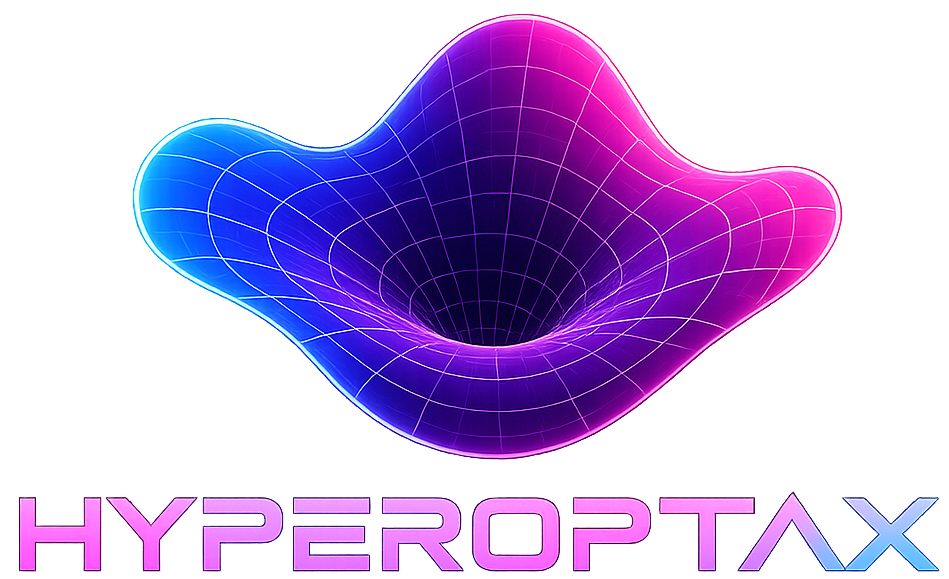

# Hyperoptax: parallel hyperparameter tuning with JAX

[](https://pypi.org/project/hyperoptax)

[](https://codecov.io/gh/TheodoreWolf/hyperoptax)

Hyperoptax is a small, functional hyperparameter-optimization library for JAX.
It supports nested PyTree search spaces, batched candidate evaluation, Python and
`jax.lax.scan` loops, and random, grid, and Gaussian-process Bayesian search.

## Installation

```bash
uv pip install hyperoptax
```

Install the optional notebook dependencies with:

```bash
uv pip install "hyperoptax[notebooks]"
```

Install the local dashboard and live SQLite recorder with:

```bash
uv pip install "hyperoptax[dashboard]"
```

Hyperoptax requires Python 3.10 or newer. For accelerator-specific JAX wheels,
follow the [JAX installation guide](https://docs.jax.dev/en/latest/installation.html).

## Quick start

Every optimizer follows the same functional pattern: `init` returns an immutable
state PyTree and an optimizer, and the objective has signature
`objective(key, params) -> scalar`.

```python
import jax
import jax.numpy as jnp

from hyperoptax import BayesianSearch, LinearSpace, LogSpace


def objective(key, params):
    noise = 0.01 * jax.random.normal(key)
    return (
        (jnp.log10(params["learning_rate"]) + 3.0) ** 2
        + (params["dropout"] - 0.2) ** 2
        + noise
    )


space = {
    "learning_rate": LogSpace(1e-5, 1e-1),
    "dropout": LinearSpace(0.0, 0.5),
}

state, optimizer = BayesianSearch.init(
    space,
    n_max=80,
    n_parallel=4,
    maximize=False,
)
state, (params_history, results_history) = optimizer.optimize_scan(
    state,
    jax.random.PRNGKey(0),
    objective,
    n_iterations=20,
)

print(optimizer.best_result(state))
print(optimizer.best_params(state))
```

Here `n_iterations=20` and `n_parallel=4` perform 80 objective evaluations.
For buffered optimizers, `n_max` is the number of observations the state can
store, not the number of iterations. Keep `n_max` divisible by `n_parallel` to
avoid evaluating a partially storable final batch.

## Choosing an optimizer

| Optimizer | Best suited to | Important constraints |
|---|---|---|
| `RandomSearch` | Cheap baseline and broad exploration | Stateless; does not retain observations |
| `GridSearch` | Small, explicitly enumerated grids | Every leaf must be a numeric `DiscreteSpace`; make the grid size divisible by `n_parallel` |
| `BayesianSearch` | Expensive, smooth objectives | Fixed `n_max` buffer; GP cost grows with the buffer size |

All spaces may be nested in arbitrary dict/list/tuple PyTrees. Available leaf
types are `LinearSpace`, `LogSpace`, `DiscreteSpace`, `QLinearSpace`, and
`QLogSpace`. `DiscreteSpace` values must be numeric because optimizers represent
candidates as JAX arrays.

### Random and grid search

```python
from hyperoptax import DiscreteSpace, GridSearch, RandomSearch

# Random search: 10 batches of 8 independent samples.
random_state, random_search = RandomSearch.init(space, n_parallel=8)
random_state, random_history = random_search.optimize(
    random_state, jax.random.PRNGKey(1), objective, n_iterations=10
)

# Grid search: six points, evaluated two at a time.
grid_space = {
    "width": DiscreteSpace((64, 128, 256)),
    "depth": DiscreteSpace((2, 4)),
}
grid_state, grid_search = GridSearch.init(grid_space, n_parallel=2)
```

Pass `shuffle=True` and an explicit PRNG key to randomize grid traversal
reproducibly:

```python
grid_state, grid_search = GridSearch.init(
    grid_space,
    key=jax.random.PRNGKey(2),
    shuffle=True,
    n_parallel=2,
)
```

## Python loop versus JAX scan

`optimize()` runs the outer loop in Python and returns lists indexed by
iteration:

- `params_history`: list of PyTrees whose leaves have leading shape
  `(n_parallel, ...)`.
- `results_history`: list of arrays with shape `(n_parallel,)`.

`optimize_scan()` uses `jax.lax.scan`, requires a JAX-traceable objective, and
returns stacked arrays:

- `params_history`: PyTree with leaf shape
  `(n_iterations, n_parallel, ...)`.
- `results_history`: array with shape `(n_iterations, n_parallel)`.

Both paths use `jax.vmap` to evaluate each batch. Use the lower-level
`get_next_params` and `update_state` methods when evaluations must run in an
external system.

## Live dashboard

To view the quick-start study live, replace its `optimize_scan()` call with the
Python loop and a recorder callback:

```python
from hyperoptax.dashboard import SQLiteRecorder, StudyConfig

study = StudyConfig(
    name="quick-start",
    direction="minimize",
    optimizer_name=type(optimizer).__name__,
    optimizer_config={"n_max": 80, "maximize": False},
    search_space=space,
    n_parallel=optimizer.n_parallel,
    seed=0,
)

with SQLiteRecorder("results.sqlite3", study=study) as recorder:
    state, (params_history, results_history) = optimizer.optimize(
        state,
        jax.random.PRNGKey(0),
        objective,
        n_iterations=20,
        callback=recorder,
    )
```

Once the recorder has created the database, start the dashboard in another
terminal on the same host:

```bash
hyperoptax dashboard results.sqlite3
```

The server listens on loopback by default. For a remote run, keep the database
and dashboard on the recorder host, then forward the printed port from your
laptop, using `ProxyJump` as needed:

```bash
ssh -N -L 8080:127.0.0.1:8080 user@remote-host
```

Open <http://127.0.0.1:8080> locally. `optimize_scan()` intentionally has no
callback because its iterations execute inside compiled `jax.lax.scan`; its
history is available only after the scan returns and is therefore bulk-only.
Use `optimize()` when the dashboard must update during a run.

Callback-recorded trials include the observed batch wall time from objective
launch through host synchronization. Every member of a parallel batch receives
the same duration and `metadata.duration_scope="parallel_batch"`; the first
batch can include JAX compilation, so compare costs only across compatible
hardware and execution modes. Imported histories keep timing unset rather than
inventing it.

Import a completed history from either loop shape without inventing trial
timestamps:

```python
from hyperoptax.dashboard import import_history

import_history(
    "results.sqlite3",
    study=study,
    params_history=params_history,
    results_history=results_history,
)
```

Use SQLite's online backup API before copying a database that may still be
written, and export bounded study queries to JSON or CSV:

```bash
hyperoptax snapshot results.sqlite3 --output results-snapshot.sqlite3
hyperoptax export results.sqlite3 --study STUDY_UUID --output trials.csv
hyperoptax export results.sqlite3 --study STUDY_UUID --output best.json \
  --query @trial-query.json
```

The dashboard's typed Python query surface is `StudyQueryService`; the same
read-only operations are available under `/api/v1` with an OpenAPI schema at
`/api/v1/openapi.json`. This is the intended interface for coding agents and
other clients—neither needs to automate the browser or depend on the SQLite
schema.

The experiment explorer can place any numeric trial field on X or Y, colour by
a third field, switch axes between linear and logarithmic scales, and apply two
numeric range filters. Its state is encoded in the URL, while **Copy view JSON**
produces the versioned declarative recipe intended for agents and reproducible
analysis. Clicking a plot point or trial ID opens the complete trial
configuration without requiring direct SQLite access.

When objective and recorded duration are selected, the explorer can overlay the
direction-aware Pareto front. Agents can query the same result directly:

```text
GET /api/v1/studies/{study_id}/pareto
    ?x_field=duration_seconds
    &y_field=objective_value
    &x_direction=minimize
    &y_direction=maximize
```

The Parameters section also reports study-level hyperparameter importance. It
fits a deterministic 200-tree `RandomForestRegressor` to completed trials and
shows its impurity-based feature importance beside Pearson's linear correlation.
Only numeric parameters present in every completed trial are included; both
measures are descriptive rather than causal.

## JAX constraints

The usual [JAX sharp bits](https://docs.jax.dev/en/latest/notebooks/Common_Gotchas_in_JAX.html)
apply:

1. The objective must accept a PRNG key and one unbatched parameter PyTree, and
   return a scalar.
2. Every batch is evaluated with `jax.vmap`; data-dependent Python control flow
   and side effects are not supported.
3. Strings and variable-shaped model structures cannot be represented as
   batched JAX hyperparameters. Encode categorical choices numerically and map
   them to host-side labels where needed.
4. Parameters that change evaluation shape or duration can interact poorly with
   parallel batches; use `n_parallel=1` when evaluations cannot be synchronized.

## Notebooks

See [`notebooks/`](notebooks/) for grid/Bayesian search examples, design
studies, high-dimensional behavior, performance comparisons, RL tuning, and GP
visualization. [`dashboard_sweep.ipynb`](notebooks/dashboard_sweep.ipynb) is the
reproducible Branin sweep used to exercise live recording and the dashboard.

## Contributing

```bash
git clone https://github.com/TheodoreWolf/hyperoptax
cd hyperoptax
uv pip install -e ".[all]"
uv run pytest -m "not timing"
uv run ruff check src tests
uv run ruff format --check src tests
```

The full suite includes optional timing tests; run `uv run pytest` when you want
those as well. Please keep objectives reproducible by passing and splitting JAX
PRNG keys explicitly.

## Roadmap

- Add explicit early-stopping controls.
- Reuse GP kernel blocks instead of rebuilding the full matrix each iteration.
- Replace the fixed number of length-scale Adam steps with a convergence-aware
  stopping criterion.
- Add more optimizer families for mixed and cost-sensitive search spaces.

## Citation

```bibtex
@misc{hyperoptax,
  author = {Theo Wolf},
  title = {{Hyperoptax}: Parallel hyperparameter tuning with JAX},
  year = {2025},
  url = {https://github.com/TheodoreWolf/hyperoptax}
}
```
