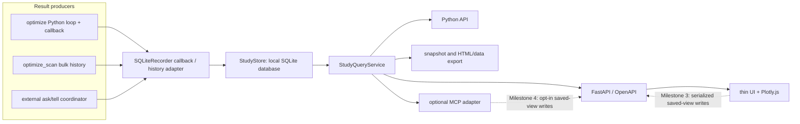

# Hyperoptax dashboard implementation plan

Status: Milestone 1 and the Constellation-inspired explorer implemented on
2026-07-17; persisted saved views and later milestones remain planned

Related research: [dashboard-landscape.md](dashboard-landscape.md)

## Implemented vertical slice

The architecture spike and Milestone 1 now exist in the repository:

- `Optimizer.optimize` emits dependency-light, host-valued `BatchCompleted`
  events through an optional synchronous callback; `optimize_scan` remains pure.
- `SQLiteRecorder` commits one complete parallel batch per revision and records
  completed/failed study lifecycle state. `import_history` normalizes both public
  history shapes with one whole-history host transfer and no invented trial
  timing.
- A schema-versioned, host-local SQLite store backs one typed
  `StudyQueryService`, read-only FastAPI/OpenAPI routes, consistent online
  snapshots, and filtered JSON/CSV exports.
- The no-build browser client was selected for the first release. It bundles
  Plotly.js, renders the initial views, links filtering and selection,
  supports base paths and light/dark themes, and requires no network assets.
- A generic experiment explorer now maps any numeric fields onto X, Y, and
  colour, supports scale and range controls, serializes its state into the URL
  and versioned view JSON, and opens an inspectable/copyable trial detail view.
- Recorded callback batches carry their measured wall time. The explorer and a
  typed `/pareto` query expose the objective-duration frontier while labelling
  parallel-batch duration semantics explicitly.
- Running studies poll after two seconds, back off to ten seconds while
  unchanged, update through revision deltas, and stop polling when terminal.
- `notebooks/dashboard_sweep.ipynb` records a Branin sweep that exercises random
  and serial/parallel Bayesian search against the live viewer.

The implementation check loaded a deterministic 10,000-trial study in roughly
2.0 seconds in the local in-app browser, rendered a bounded 1,000-row DOM table,
sampled each plot to 5,000 visibly disclosed points, and applied a unique-trial
text filter in roughly 60 ms. These are one-machine spike measurements, not
performance guarantees, but they support retaining the no-build client for the
first release.

The Python service and `/api/v1` OpenAPI surface are the implemented read-only
agent interface. URL/view-JSON recipes are shareable but not persisted server
objects. Persisted saved views, a dedicated MCP adapter, external ask/tell trial
lifecycle, and cross-study aggregation remain Milestones 2–4.

## Proposed outcome

Hyperoptax should gain an optional, local-first dashboard that turns a study's
trial records into an interactive browser UI and a stable programmatic query
surface.

The target first experience is:

```sh
uv pip install "hyperoptax[dashboard]"
hyperoptax dashboard /path/to/results.sqlite3
```

The command should print a loopback URL, open no public listener by default, work
without internet access, and show useful views without configuration:

- Live batch-by-batch progress while `Optimizer.optimize` is running with a
  local recorder callback.
- Study status, optimizer configuration, objective direction, trial count, and
  best result.
- A filterable and sortable trial table.
- Objective and best-so-far history.
- Parallel coordinates with linked trial selection.
- Parameter slice plots and distributions.
- Timing and batch/parallelism views when those fields are present.

The same study must be queryable through Python and HTTP. A later MCP adapter
should expose that semantic API to agents without making them automate the UI or
read a private database schema.

This is deliberately **not** a plan for a hosted W&B competitor. The first
version is a live local viewer and analysis service over user-owned Hyperoptax
results.

## Product principles

1. **Local first.** A complete dashboard must work on a laptop, an SSH-reachable
   recorder host, or an air-gapped machine. The initial SQLite database lives on
   local disk, not a shared network filesystem.
2. **Core stays lean.** JAX optimizers must not acquire web-server or plotting
   dependencies unless the dashboard extra is installed.
3. **Live progress is core.** An optional host callback persists every completed
   Python-loop batch; the dashboard shows it within the polling interval.
4. **The records are the product boundary.** Storage, queries, UI, exports, and
   agent tools all consume one documented study/trial model.
5. **Curated before configurable.** Ship the plots that answer common HPO
   questions before building a drag-and-drop canvas.
6. **One serialized filter contract.** Browser components share one
   `TrialQuery`. Agent tools accept that query, or a saved-view ID, rather than
   trying to infer transient browser state.
7. **Reproducible built-in views.** Persist a query and a small built-in view
   recipe. Treat arbitrary agent-generated figures as bounded snapshots unless
   their transformation is expressible by a built-in view.
8. **No hidden approximation.** Sampling, aggregation, clipping, and omitted
   trials must be reported with the plot.
9. **Safe remote defaults.** Loopback by default; public/team serving requires
   an explicit authentication boundary.
10. **Agents use typed tools.** No arbitrary SQL, Python, or JavaScript in the
   standard agent path.

## Current Hyperoptax constraints

The dashboard design has to fit the actual optimizer API rather than assuming an
experiment tracker already exists.

### Result shapes

[`Optimizer.optimize`](../../src/hyperoptax/base.py#L58-L87) executes a Python
loop and returns:

- A list of parameter PyTrees, one per iteration, with a leading
  `n_parallel` axis.
- A list of result arrays, one per iteration, with shape `(n_parallel,)`.

[`Optimizer.optimize_scan`](../../src/hyperoptax/base.py#L89-L142) runs the loop
inside `jax.lax.scan` and returns stacked parameter leaves with shape
`(n_iterations, n_parallel, ...)` plus a result array with shape
`(n_iterations, n_parallel)`.

The public documentation already recommends the lower-level
`get_next_params`/`update_state` path for external schedulers
([README](../../README.md#python-loop-versus-jax-scan)). That is the natural
place for a distributed recorder.

### JAX side-effect boundary

Live persistence cannot be inserted identically into both loop styles:

- `Optimizer.optimize` can accept an optional Python callback invoked once after
  each completed batch. When present, it performs one tree-wide
  `jax.device_get((params, results))`, creates a host-valued `BatchCompleted`
  event, and calls the callback synchronously. A local recorder callback commits
  that event to SQLite before the next batch starts. The synchronization and
  storage cost are opt-in and must be measured.
- The compiled scan must remain pure. Its complete history should be imported
  after the scan returns with one bulk `jax.device_get`. Do not use
  `jax.debug.callback` inside the scan: it would add an ordered side effect to
  the compiled optimization and complicate both performance and failure
  semantics.
- An external ask/tell loop can record each completed batch in its coordinator,
  independent of where workers evaluate the objective.

This makes live progress the normal dashboard path for the Python loop and for
external coordinators. `optimize_scan` remains a bulk result import after
completion; it does not claim per-iteration live progress.

### Existing state is not a study record

Bayesian search keeps a fixed-size `X`, `y`, and validity mask to satisfy JAX
static-shape requirements
([BayesianSearchState](../../src/hyperoptax/bayesian.py#L17-L37)). That state is
an optimizer implementation detail, not a sufficient experiment log:

- It lacks trial timestamps, batch slot, duration, status, seed, and provenance.
- Random search is intentionally stateless.
- Nested PyTree paths and user-facing categorical labels need a stable
  serialization convention.
- The same record format must work across every optimizer.

The recorder must therefore observe batches and create independent trial
records. The dashboard should not introspect optimizer-specific state as its
primary data source.

### Dependency boundary

The core package currently depends only on JAX, Optax, and Jaxtyping
([`pyproject.toml`](../../pyproject.toml#L1-L8)). Dashboard dependencies belong
in an optional extra and separate modules so importing `hyperoptax` never starts
web or storage machinery.

`BatchCompleted` and the `BatchCallback` callable alias are dependency-light
core types. `SQLiteRecorder`, FastAPI, and browser assets belong to the dashboard
extra. A user can therefore supply any callable without installing or importing
the dashboard.

### Terminology and grouping

Use three levels consistently:

- A **trial** is one candidate evaluation, including one slot of a parallel
  batch.
- A **study** is one optimizer execution with a shared objective, search space,
  direction, and optimizer configuration.
- A **sweep** is an optional named collection of comparable studies, such as
  repeated seeds or several optimizer configurations on the same benchmark.

The live MVP can focus on one study while still storing `sweep_id`,
`variant`, and `replicate` metadata. Cross-study aggregation then becomes an
additive query/UI feature rather than a record-schema migration. This distinction
also fits the repository notebooks, which often compare several seeded optimizer
runs inside one larger design sweep.

## Proposed architecture



The important separation is that the UI and MCP adapter are clients of
`StudyQueryService`. Neither is allowed to build its own database queries or
derive a second interpretation of the study schema.

## Architecture decisions

| Area | Draft decision | Rationale |
|---|---|---|
| Default storage | One SQLite database file on local disk of the recorder/coordinator host | Zero service setup, transactional snapshots, good local querying; one file may contain several studies |
| Storage contract | `StudyStore` protocol | Keeps UI/query logic independent and leaves room for PostgreSQL or files later |
| Live recording | Optional synchronous `BatchCompleted` callback on `Optimizer.optimize` | Persists each batch locally as soon as it completes without adding dashboard dependencies to the optimizer core |
| Writer topology | One recorder/coordinator writes trial data; dashboard APIs are read-only through Milestone 2 | Avoids pretending SQLite is a cluster database; later saved-view writes are serialized through one dashboard server on the same host |
| Server | FastAPI plus Uvicorn | Typed request models, OpenAPI for agents/clients, ordinary HTTP deployment |
| Chart engine | Bundled Plotly.js in the browser | HPO plot coverage and interactive rendering without requiring Plotly.py on the server |
| Frontend | Spike vanilla JavaScript/no-build against React plus Vite | TypeScript requires a build step; choose it only if linked-selection state justifies the machinery |
| Refresh | Poll the study revision every 2 seconds while running, with backoff while unchanged | Near-real-time feedback without committing to WebSockets or SSE |
| Built-in chart contract | Fixed history/best/parallel views plus one versioned numeric scatter `ViewSpec` | Covers the first product without inventing a general plotting language |
| Agent-created charts | Validated, bounded Plotly figure JSON; never JavaScript | Lets agents make novel figures while keeping executable code out of the server |
| Agent transport | Python service first, REST/OpenAPI second, MCP adapter third | One behavior surface with several transports |
| Network default | `127.0.0.1` only | Safe local and tunnel workflow |
| Production serving | Out of MVP; documented reverse-proxy contract | Authentication/TLS are not concerns to half-implement |
| Hosted sync | Out of initial scope | Requires accounts, service operations, governance, and durable compatibility |

FastAPI is proposed because agent access is a product requirement. Dash would
make the first Plotly page quickly, but it would not remove the need for a
separate semantic API. The spike should compare a no-build browser client with a
small React/Vite client; data access and built-in view semantics remain
framework-neutral in either case.

## Study and trial record model

The API-facing models should be explicit Pydantic models in the optional
dashboard package. Internal events can use frozen dataclasses. The serialized
schema is versioned from its first release.

### Study

`sweep_id`, `variant`, and `replicate` are optional grouping labels on a study.
The MVP does not need a separate sweep entity or table; compatible studies can
be grouped by those fields later.

Minimum fields:

```text
study_id               stable UUID
sweep_id               optional grouping UUID
name                   user-facing name
created_at             UTC timestamp
finished_at            optional UTC timestamp
status                 created | running | completed | failed | cancelled
direction              maximize | minimize
optimizer_name         RandomSearch | GridSearch | BayesianSearch | custom
optimizer_config       JSON-safe configuration
search_space           typed, nested path/space description
seed                   optional integer or serialized PRNG metadata
n_parallel             integer
code_version           Hyperoptax version
source_revision        optional git commit
variant                optional comparable configuration label
replicate              optional seed/replicate label
tags                   string list
metadata               JSON object
revision               monotonically increasing trial-data integer
schema_version         integer
```

### Trial

Hyperoptax evaluates batches, but users analyze trials. Each batch result is
therefore flattened into one record per batch slot:

```text
trial_id               stable within study
study_id
batch_index            optimizer iteration
batch_slot             index in n_parallel
evaluation_index       total order when known
state                  pending | running | completed | failed | cancelled
params                 nested JSON-safe value tree
objective_value        optional scalar
started_at             optional UTC timestamp
finished_at            optional UTC timestamp
duration_seconds       optional float
seed                   optional per-trial seed metadata
worker                 optional host/job/task identifier
error                  optional structured error
metadata               JSON object
created_revision       study data revision that inserted this trial
updated_revision       latest study data revision that changed this trial
```

The MVP should support the scalar objective Hyperoptax has today. Multi-objective
values and intermediate metrics should be designed as additive tables rather
than encoded into the scalar field, but they do not need to block the first UI.

### Parameter representation

Store one canonical nested JSON representation per trial. Flatten it into typed
columns at the query/client boundary using the study's search-space schema.
Parameter paths must be deterministic and reversible: use JAX key paths and a
documented escaping rule instead of concatenating arbitrary dictionary keys with
an ambiguous separator. The schema supplies display names, scale (`linear`,
`log`, or quantized), bounds, and optional categorical labels.

Do not duplicate every parameter into an EAV index in the first schema. The
10,000-trial spike should measure JSON decoding, filtering, and payload cost
first. Materialize an indexed parameter table only for fields and workloads
that demonstrate a real need.

### Saved view (Milestone 3)

```text
view_id
study_id
title
description
trial_query            versioned JSON
panels                  built-in ViewSpec recipes plus grid position/size
created_at
created_by             user | agent plus identifier when available
prompt                  optional natural-language provenance
renderer_version
```

Re-run the saved global query against the study, then render each built-in panel
recipe. Every panel consumes that same filtered trial set; panel-specific query
overrides are deliberately deferred so filter composition cannot become
ambiguous. An arbitrary agent-generated Plotly figure may be saved only as a
bounded frozen panel with the source study revision clearly recorded. It does
not silently become a live transformation.

## Storage design

### MVP: local SQLite

SQLite is appropriate when one recorder/coordinator writes and the dashboard
reads on the same host. A database file may contain several studies. Suggested
tables for the first two milestones:

```text
studies
trials
schema_migrations
```

Add `saved_views` in Milestone 3. Use transactions per completed batch so a
dashboard never observes a partial batch. Initially index `study_id`,
`evaluation_index`, `state`, `objective_value`, and `updated_revision`. Each
trial transaction increments the study's data `revision`; inserted or changed
rows receive that same value in `created_revision`/`updated_revision`. Because
trial deletion is not exposed, `/changes?since_revision=N` can return every row
whose `updated_revision` is greater than `N` without a tombstone log.

Configure a bounded SQLite `busy_timeout` on recorder and dashboard connections,
keep callback writes and API reads short, and finish the read transaction before
serializing or rendering data. A dashboard poll must not hold a lock while the
optimizer waits to commit its next batch.

In Milestone 3, trial tables remain recorder-owned. Saved-view mutations are
short metadata transactions issued only by one dashboard server on that same
host; SQLite serializes them with recorder transactions. No browser or agent
opens the database directly for writing.

WAL mode may improve same-host read/write concurrency, but it must not be used
as evidence that SQLite is a multi-node store. SQLite states that WAL does not
work across machines on a network filesystem because its index uses shared
memory. See the official
[WAL documentation](https://sqlite.org/wal.html). The CLI should record the
storage mode. Start with SQLite's default journal mode and enable WAL only if the
same-host contention/snapshot spike justifies it. The supported contract is
local-disk SQLite; the CLI should not pretend it can reliably identify every
network mount. Shared-home and other network-filesystem SQLite databases are
unsupported in the MVP, with or without WAL.

### Cluster topology

The first supported live topology is:

```text
workers -> scheduler/coordinator -> one recorder -> SQLite on host-local disk
                                      |              |
                                      |              +-> dashboard on same host
                                      +-> periodic consistent snapshot -> durable storage
```

Workers should not each open the SQLite file. Live viewing requires the recorder
host to be SSH-reachable, directly or through a jump host. If an ephemeral
compute node is not reachable, publish periodic consistent snapshots under
immutable revisioned names such as `results-r0042.sqlite3`, then copy the newest
one onto local disk of the login node or laptop before opening it. Replacing the
pathname beneath an open SQLite connection is unsupported; the viewer must
explicitly reopen the new snapshot. That path is intermittently refreshed, not
live. A dashboard on a login node cannot tail a live SQLite file on shared
storage. That topology needs a network database or ingestion service behind
`StudyStore`.

### Consistent snapshots

Copying a live SQLite main file is not a safe snapshot when journals or WAL files
are active. Provide a command that uses SQLite's
[online backup API](https://sqlite.org/backup.html):

```sh
hyperoptax snapshot /path/to/results.sqlite3 --output results-snapshot.sqlite3
```

The command finishes and closes the backup before it is published or copied.
The snapshot can then be transferred with `scp`/`rsync`, opened locally, or fed
to a static export. This is the supported "visualize remote data locally" path
for completed or intermittently refreshed results. Periodic producers create a
new revisioned filename; an automatic manifest-and-reload protocol is a later
feature, not implicit file replacement.

### Future stores

- PostgreSQL for authenticated multi-writer/team deployments.
- An append-only file bundle only if it proves materially easier for batch jobs
  than SQLite snapshots.
- Object storage for large artifacts, not as the first transactional metadata
  store.

Avoid introducing DuckDB, Parquet, and SQLite simultaneously. They can be added
behind export/query boundaries if real scale measurements justify them.

## Recording and importing results

### 1. Python-loop callback: first vertical slice

Live progress is the first recording path. Add one optional keyword-only callback
to the existing Python-loop API and thread it through the `BayesianSearch`
override:

```python
def optimize(
    self,
    state: OptimizerState,
    key: jax.Array,
    func: Callable,
    n_iterations: int,
    *,
    callback: BatchCallback | None = None,
) -> tuple[OptimizerState, tuple[PyTree, jax.Array]]: ...
```

`BayesianSearch.optimize` keeps its existing `n_iterations=None` behavior and
forwards the callback after deriving the iteration count. The dependency-light
event is deliberately small:

```text
BatchCompleted
  batch_index
  params          host-valued PyTree with leading n_parallel axis
  results         host-valued array with shape (n_parallel,)
```

After `update_state` and history append, the loop performs one tree-wide
`jax.device_get((params, batch_results))`, constructs the event, and invokes the
callback synchronously. With no callback, the current loop and synchronization
behavior remain unchanged.

The dashboard extra supplies a callable/context manager:

```python
with SQLiteRecorder("results.sqlite3", study=study_config) as recorder:
    final_state, history = optimizer.optimize(
        state,
        key,
        objective,
        n_iterations,
        callback=recorder,
    )
```

Entering the context creates a running study. Each callback splits the batch
into trials and commits one atomic SQLite transaction, including the new study
revision. Normal exit marks the study completed; exceptional exit marks it
failed. The dashboard is a separate read-only process polling that same
host-local database.

Requirements:

- Exactly one callback invocation per completed batch, in increasing
  `batch_index` order.
- One `jax.device_get` over the batch PyTree, not one transfer per leaf or trial.
- A synchronous commit: once the callback returns, the dashboard can observe the
  entire batch or none of it.
- A batch idempotency key derived from `(study_id, batch_index)` so an explicit
  recorder retry cannot duplicate trials.
- The callback return value is ignored: this is observation, not an early-stop
  or optimizer-mutation interface.
- Callback exceptions propagate normally. `SQLiteRecorder` may retry a failed
  transaction internally using the idempotency key, but it raises after retries
  are exhausted rather than silently losing a batch.
- Seeded tests prove that omitting the callback preserves the existing results,
  PRNG semantics, and device synchronization behavior.

### 2. Bulk history adapter

Keep an import path for existing results and `optimize_scan`. Provide a
constructor/function that accepts:

- Search space.
- Optimizer name/configuration and direction.
- `params_history` and `results_history` from either public loop API.
- Optional name, seed, tags, timestamps, and metadata.

It normalizes the Python-list and stacked-array variants into the same trial
records. This gives existing notebooks an immediate dashboard path, but live
Python-loop runs should prefer the callback.

### 3. External ask/tell recorder

Expose a small helper/context manager for coordinator loops. The durable batch
handle carries its ID and expected trial slots through retries:

```text
batch = study.start_batch(params, metadata)
study.complete_batch(batch, results, metadata)
study.fail_batch(batch, error)
```

Exact naming is open, but completion and failure must address the created batch,
not re-identify it from parameter values. The lifecycle represents
pending/running/failed work rather than assuming every objective call returns
successfully.

### 4. Compiled scan import

Keep `optimize_scan` pure. On return, transfer the complete history to the host
once, bulk-import it in one or several transactions, and record that live trial
timing/status was unavailable. Do not simulate timestamps that did not exist.

## Query service and HTTP API

`StudyQueryService` owns field validation, filtering, sorting, limits, and
fidelity metadata. It accepts typed request objects and returns study metadata
or tabular trial data. Plotly rendering stays in the browser.

Initial HTTP surface:

```text
GET  /api/v1/studies
GET  /api/v1/studies/{study_id}
POST /api/v1/studies/{study_id}/trials/query
GET  /api/v1/studies/{study_id}/changes?since_revision=N
```

The completed-study UI can fetch its bounded trial set once. The callback-driven
viewer uses `changes` in Milestone 1. Aggregation and saved-view routes are added
only when those features ship. There is no `/plots/render` endpoint: it would
duplicate the bundled Plotly.js renderer and pull Plotly.py into the backend
without evidence that it is needed.

`changes?since_revision=N` returns the current study revision and every trial
whose `updated_revision > N`. Pending/running rows may therefore be replaced by
their newer representation, while newly completed rows are appended. Trial
deletion is outside this API, so the MVP needs no tombstones.

Use structured filter objects rather than a SQL string:

```json
{
  "columns": ["trial_id", "objective_value", "params.learning_rate"],
  "filters": [
    {"field": "state", "op": "eq", "value": "completed"},
    {"field": "params.learning_rate", "op": "between", "value": [1e-5, 1e-3]}
  ],
  "sort": [{"field": "objective_value", "direction": "desc"}],
  "limit": 1000
}
```

Allowed operators should be a small enum: equality/inequality, range,
membership, missingness, and safe text matching. The service resolves display
paths to stored parameter paths and rejects unknown fields.

Every response that may be approximate includes:

```text
rows_total
rows_returned
sampled
sampling_method
aggregation
point_limit
study_revision
```

FastAPI's OpenAPI and JSON Schema support make this API self-describing for
humans and agents. See its official
[feature description](https://fastapi.tiangolo.com/features/).

## View and figure specifications

Do not design a general plotting grammar. Define one small numeric scatter
`ViewSpec` for the configurable explorer and retain fixed recipes for the
purpose-built history, best-so-far, parallel-coordinate, and importance views:

```json
{
  "version": 1,
  "chart": "scatter",
  "x": {"field": "params.learning_rate", "scale": "log"},
  "y": {"field": "objective_value", "scale": "linear"},
  "color": null,
  "filters": [],
  "pareto": null
}
```

The initial browser recipes are:

```text
history
best_so_far
parallel_coordinates
scatter
hyperparameter_importance
```

The scatter recipe contains only numeric field mappings, scales, up to two range
filters, and the optional objective-duration Pareto definition. It is combined
with the global `TrialQuery`, rendered to Plotly.js traces in the client, and
updates when new trials arrive.

An agent that needs a chart outside the built-in forms first queries bounded typed
data, then submits a wrapper containing Plotly figure JSON (`data`, `layout`,
and optional `frames`) plus a separate optional `config` object for preview.
Validate the wrapper against a documented Hyperoptax subset: explicitly allowed
trace types, trace/layout fields, scalar/array value types, and `config` keys.
Impose trace, frame, point, and byte limits; reject external URLs,
script-bearing content, and unknown keys. Do not claim full Plotly-schema
validation in the MVP. No generated JavaScript is accepted. Such a figure is
tied to the source study revision and is a snapshot: refreshing it requires
asking the agent to regenerate it. Plotly.py remains an optional spike, not a
dashboard dependency.

## Browser UI

### Navigation

```text
Studies
  Study overview
    Overview
    Trials
    Parameters
    Timing
    Bayesian diagnostics (when available)
    Saved views (Milestone 3)
```

Only show a page when the study has the required data. For example, timing is
hidden when histories were imported without timestamps, and Bayesian diagnostic
surfaces appear only when the required model data can be reconstructed through a
public diagnostic interface.

### Study overview

Default cards:

1. Best objective and parameter summary.
2. Completed trial count and running/completed study status. Pending, running,
   and failed trial counts appear only when the external lifecycle in Milestone
   2 supplies those states.
3. Objective by evaluation index.
4. Best-so-far curve, step-aligned to batch boundaries.
5. Trial duration/timeline when available.
6. Top trials table.

For repeated seeds or comparative studies, aggregate curves should default to
median plus IQR and state that aggregation explicitly. Do not draw uncertainty
bands when there is only one series.

### Canonical trials table

The trial table owns the global filter and selection state. Required behavior:

- Sort and filter every schema field in the loaded trial set.
- Choose visible columns.
- Stable trial colors/selection.
- Select, hide, pin, and compare trials.
- Deep-link to a trial.
- Export exactly the filtered rows.
- Show active filters and total/returned row counts.

Every plot consumes this filtered trial set. Brushing a parallel-coordinate axis
or selecting points updates the same state and table. A browser reload should be
able to restore the serialized `TrialQuery` from a compact URL, and later from a
saved view. Agent tools accept that explicit query or saved-view ID; they do not
silently mirror an ephemeral browser selection.

### Curated parameter views

- Parallel coordinates for high-dimensional relationships.
- A field-composable scatter explorer that subsumes one-parameter slices and
  score-versus-duration views.
- Pairwise contour/heatmap for two selected numeric parameters.
- Scatter matrix for a bounded parameter subset.
- Parameter distributions split by top quantile or trial state.
- Parameter importance only after selecting and documenting an evaluator; do not
  present correlation as causal importance.

### Hyperoptax-specific views

The repository's existing notebooks suggest additional useful panels:

- Regret/best-so-far by cumulative evaluations.
- Median and IQR across seeds.
- Score versus elapsed time.
- Evaluations per second.
- Batch size/`n_parallel` comparisons aligned by cumulative evaluation count.
- For low-dimensional Bayesian search, optional GP mean, uncertainty, and
  acquisition surfaces over time.

The first release should implement the general trial views plus best-so-far.
Notebook-specific benchmark aggregation and GP surfaces can follow once their
data contracts are explicit.

### Refresh and scale

For a completed study, fetch the bounded trial set once, virtualize rows, and do
filtering, selection, and the built-in view transforms in the client. The
10,000-trial spike decides whether that remains viable; do not add server
pagination before it demonstrates a need.

Milestone 1 starts with revision polling every 2 seconds while a study is
running:

1. Request changes after the last `study_revision`.
2. Append completed immutable trials and replace the mutable tail.
3. Re-run only queries affected by new data.
4. Update plots with `Plotly.react` while preserving zoom and selection where
   valid.

Back off toward 10 seconds after repeated unchanged responses and stop polling a
completed study. Make the active interval configurable. Here, "real-time" means
that a committed callback batch normally appears on the next poll, not that the
system offers sub-second streaming guarantees.

No WebSocket or SSE is needed for the first version. Reconsider only if measured
polling cost or latency is a real problem.

Proposed initial budgets to validate in the spike:

- 10,000 trials loaded once, with a virtualized table.
- 5,000 points per Plotly trace by default.
- A visible warning and exact export path whenever a plot is sampled.

If the test fails, add server pagination or aggregation for the measured
bottleneck. Do not add both speculatively.

These are performance hypotheses, not permanent API guarantees.

### Frontend packaging

- Bundle Plotly.js and all application assets in the wheel; no CDN dependency.
- Serve under a configurable base path for JupyterHub and reverse proxies.
- Preserve keyboard navigation, colorblind-safe palettes, dark/light themes, and
  responsive layouts from the start.
- Build frontend assets in development/release tooling, not on the user's cluster.
- Keep the initial component system small. Choose React/Vite only if the vanilla
  JavaScript spike cannot cleanly support linked selection and incremental
  updates.

## Agent interface

### Do not embed a required model provider

The dashboard should be useful to agents without owning an LLM API key or
shipping a chat panel. A coding agent already has a model and needs tools. Keep
model choice outside Hyperoptax; expose data and safe plotting capabilities.

### Tool surface

The MCP adapter should map directly onto `StudyQueryService`:

```text
list_studies
describe_study
query_trials(trial_query)
get_trial
preview_view       # TrialQuery or saved-view ID plus a built-in ViewSpec
preview_figure     # validated figure JSON plus separately allowlisted config
export_data
save_view          # Milestone 4, omitted unless agent writes are enabled
```

Resources can expose the study schema and saved-view definitions. Tools return
structured content plus, where useful, an HTML or image preview.

### Read/write boundary

- HTTP is read-only through Milestone 2, and MCP is read-only by default.
- `preview_view` and `preview_figure` never persist.
- In Milestone 3, every saved-view mutation goes through one dashboard server on
  the same host as the local SQLite database. Milestone 4 may register the same
  operation as an agent tool only with `--allow-agent-write` or equivalent.
- Study/trial deletion and optimizer control are not part of the dashboard agent
  surface.
- Every saved agent view records its query, built-in recipe or frozen figure,
  source study revision, prompt if provided, creation time, and tool/client
  identity when available.

### Query and privacy limits

- Agents discover field names before querying.
- Default result limits are conservative.
- Later aggregation happens server-side; initial queries return bounded rows.
- The response identifies sampling and omitted rows.
- Local STDIO MCP keeps database access and the MCP transport local. The agent
  client may still send returned tool data to a remote model provider, so users
  must apply the provider's data policy when enabling the tools.
- Remote HTTP MCP requires ordinary authentication and TLS; SSH tunnelling is the
  initial documented path.
- Never send a whole study to an external model implicitly. The user/agent host
  decides what tool results enter model context.

### Why no generated code

Optuna's LLM integration proves that typed study context plus locally executed
plot logic can work, but it ultimately evaluates generated JavaScript.
Hyperoptax instead gives agents typed, bounded rows and accepts validated Plotly
figure JSON. Built-in `ViewSpec` recipes cover live charts; arbitrary agent
figures cover one-off questions as explicit snapshots. Neither path needs a code
sandbox.

## Local and remote workflows

### Live local study

```python
# Training process
with SQLiteRecorder("results.sqlite3", study=study_config) as recorder:
    final_state, history = optimizer.optimize(
        state,
        key,
        objective,
        n_iterations,
        callback=recorder,
    )
```

```sh
# A second terminal on the same host
hyperoptax dashboard ./results.sqlite3
```

Each completed callback transaction advances the study revision. The next UI
poll adds the batch to the table and updates history, best-so-far, and parameter
views without restarting the server.

### Local completed study

```sh
hyperoptax dashboard ./results.sqlite3
```

The server binds to `127.0.0.1`, finds an available port if 8080 is occupied,
and prints the exact URL. The UI opens a study catalogue when the database
contains more than one study.

### Live remote study with SSH

```sh
# On the remote recorder/coordinator host
hyperoptax dashboard ./results.sqlite3 --host 127.0.0.1 --port 8080

# On the laptop
ssh -N -L 8080:127.0.0.1:8080 user@login.cluster
```

For an SSH-reachable node behind a login host, use `ProxyJump` to the
recorder/coordinator host. If the compute node is not reachable, have the job
publish immutable, revision-named snapshots, copy the newest one to viewer-local
disk, and reopen it on the login node or laptop. Do not overwrite a database
path already held open by the viewer. A login-node viewer over a live shared-home
SQLite file is explicitly unsupported; truly live login-node viewing needs a
network database or ingestion service.

### Existing JupyterHub or editor gateway

Support a `--base-path` option and avoid absolute frontend URLs. A small
JupyterLab integration can come after the normal server works; the first goal is
compatibility with existing port proxies, not a custom extension.

### Snapshot and run locally

```sh
# Remote
hyperoptax snapshot ./results.sqlite3 --output results-snapshot.sqlite3

# Transfer with the user's normal cluster tooling, then locally
hyperoptax dashboard ./results-snapshot.sqlite3
```

The snapshot command is preferable to copying active database files directly.

### Static export

```sh
hyperoptax export ./results.sqlite3 --study STUDY_ID --format html --output report.html
```

The HTML export contains a bounded snapshot, the selected saved views, and
locally embedded assets. It is for presentation, not continued live querying.
Large studies should require an explicit filter or size confirmation.

### Persistent team service

Document, but do not initially own:

- Gunicorn/Uvicorn worker guidance appropriate to the store.
- Base-path and trusted-proxy configuration.
- An authenticated TLS reverse proxy.
- Read-only service accounts by default.
- PostgreSQL rather than a shared SQLite file for multi-host writers.

If the server is started with `--host 0.0.0.0` and no authentication integration,
print a prominent warning. Do not imply that a public listener is production
deployment.

## Package layout

Tentative modules:

```text
src/hyperoptax/
  recording.py              core BatchCompleted and BatchCallback alias
  dashboard/
    __init__.py
    models.py                Pydantic API/storage models
    store.py                 StudyStore protocol
    sqlite_store.py
    recorder.py              SQLiteRecorder and bulk history importer
    queries.py               StudyQueryService
    views.py                 built-in ViewSpec validation
    figures.py               later Plotly figure validation/limits
    api.py                   FastAPI application
    cli.py
    export.py
    static/                  bundled frontend and Plotly.js
  agents/
    mcp.py                   later optional adapter
```

The callback event and callable type alias belong in core because they are part
of `Optimizer.optimize`'s public API and are re-exported from `hyperoptax`.
Study/trial storage models, `SQLiteRecorder`, web-server code, and agent
dependencies remain optional.

Tentative optional dependencies:

```toml
[project.optional-dependencies]
dashboard = ["fastapi", "uvicorn"]
agents = ["mcp"]
```

Plotly.js is a bundled frontend asset, not a Python runtime dependency. Add
Plotly.py only if the spike demonstrates a server-side export or figure-building
need that the browser implementation cannot meet.

Users install both extras when they want the dashboard and MCP adapter:
`hyperoptax[dashboard,agents]`. Avoid a self-referential package extra.

Use exact compatible minimum versions only after the spike. Do not add a CLI
framework merely for two subcommands if the standard library is sufficient.

## Delivery plan

### Milestone 0: architecture spike

Goal: resolve the highest-risk decisions with disposable code.

- Convert one existing notebook sweep into normalized trial records.
- Prototype the `BatchCompleted` callback writing atomic SQLite batches while a
  dashboard polls the same database; measure commit-to-visible latency and
  optimizer overhead.
- Render history, trial table, and parallel coordinates with bundled Plotly.js.
- Compare a vanilla JavaScript/no-build client with a small React/Vite client.
- Test `Plotly.react` while retaining selection and zoom.
- Exercise 10,000 synthetic trials and record payload/render timings.
- Validate a draft `TrialQuery` and the scatter `ViewSpec` through
  Pydantic/OpenAPI.

Exit decision: frontend shape, record schema v1, and realistic point budgets.

### Milestone 1: durable records and live Python-loop viewer

- Implement study/trial models and schema migrations.
- Implement `StudyStore` and a host-local SQLite store with one trial writer.
- Add the optional `BatchCompleted` callback to `Optimizer.optimize` and forward
  it through `BayesianSearch.optimize`.
- Document and top-level export `BatchCompleted`/`BatchCallback`, including the
  explicit limitation that `optimize_scan` has no live callback.
- Implement `SQLiteRecorder`, study lifecycle handling, atomic batch writes, and
  idempotency.
- Add study revision and adaptive incremental polling.
- Import both `optimize` and `optimize_scan` history shapes.
- Preserve optional sweep/variant/replicate grouping metadata.
- Add study list, overview, trial table, objective history, best-so-far,
  parallel coordinates, hyperparameter importance, and the experiment explorer.
- Add consistent snapshot and filtered CSV/JSON export.
- Keep all assets offline and bind to loopback.
- Document a direct SSH port forward to an SSH-reachable recorder host so the
  same live callback path works on a remote cluster.

This is the first useful release.

### Milestone 2: external recording and cluster ergonomics

- Add an external ask/tell recording helper.
- Add running/failed states and timeline/resource views; callback batch duration
  is already recorded in Milestone 1.
- Document jump-host, JupyterHub/base-path, inaccessible-node snapshot, and
  persistent-service workflows.
- Test direct SSH-to-recorder and periodic-snapshot workflows. Explicitly reject
  a live shared-filesystem SQLite topology in documentation.

### Milestone 3: query API and saved views

- Stabilize `StudyQueryService` and `/api/v1`.
- Add parameter slices, pairwise contours, distributions, and timing plots.
- Add compatible cross-study/sweep queries and repeated-seed aggregation.
- Implement saved views from versioned `TrialQuery` plus built-in `ViewSpec`.
- Allow bounded agent Plotly figures to be saved only as frozen, revision-linked
  panels.
- Add preview-before-save and view provenance.
- Add static HTML report export.

### Milestone 4: agent adapter

- Expose read-only MCP resources/tools over local STDIO.
- Add bounded query and, if justified by scale, aggregate tools.
- Add built-in view preview and validated Plotly figure preview.
- Add opt-in `save_view` writes and audit/provenance fields.
- Test prompts against nested parameters, log scales, missing values, failed
  trials, and large studies.
- Document remote MCP only through secured HTTP or SSH tunnelling.

### Later, only with demonstrated demand

- PostgreSQL/multi-user storage.
- Intermediate metrics and artifact viewers.
- Multi-objective/Pareto studies.
- Notebook/editor extensions.
- Terminal UI.
- A hosted sync service.
- Third-party plot/plugin system.

## Verification strategy

### Unit tests

- With no callback, `Optimizer.optimize` retains its exact seeded results and
  callback-free execution behavior.
- With a callback, exactly one host-valued event is emitted per batch with the
  correct index, parameters, and results; `BayesianSearch` forwards it when
  `n_iterations` is explicit or inferred.
- Zero iterations emit no events; objective or `update_state` failures emit no
  event for the incomplete batch.
- Callback exceptions propagate unchanged after the completed batch event is
  constructed.
- PyTree path and value round trips.
- List-history and scan-history normalization produce identical trials.
- Batch transaction atomicity and idempotency.
- Direction-aware best-so-far calculations.
- Filter, sort, missing-value, and log-scale validation.
- `ViewSpec` rejection for unknown fields and unsupported variants.
- Plotly figure size, trace allowlist, URL, and executable-content rejection.
- Read-only mode rejects every mutating route.
- Schema migrations and snapshot consistency.

### Integration tests

- Record a small RandomSearch, GridSearch, and BayesianSearch study.
- Run `Optimizer.optimize` with `SQLiteRecorder` while the API polls; each
  committed callback batch appears once and advances the revision.
- Serve each through FastAPI and query every public endpoint.
- Append a batch while the dashboard polls and verify one incremental update.
- Import `optimize_scan` output without callbacks or compiled side effects.
- Start under a non-root base path.
- Build a static export with no external network requests.

### Browser tests

- A running study adds each committed callback batch without a reload and shows
  it within the configured polling interval.
- Filtering the table updates every chart.
- Selecting in parallel coordinates selects the same trial rows.
- Refresh preserves valid zoom/filter state.
- A 10,000-row table remains usable through virtualization; pagination is tested
  only if the spike requires it.
- Sampling and omitted-row indicators are visible.
- Keyboard navigation and dark/light themes remain usable.

### Performance tests

Measure separately:

- Database query time.
- API serialization time and payload size.
- Browser parse/render time.
- Incremental refresh cost.
- Optional recorder synchronization overhead versus no recorder.
- Callback commit-to-visible latency.

Do not optimize the database when the measured bottleneck is shipping a large
Plotly JSON payload to the browser.

## Live dashboard MVP acceptance criteria

The first public dashboard release is complete when:

- `Optimizer.optimize(..., callback=SQLiteRecorder(...))` commits every
  completed batch exactly once while the optimization is still running.
- A dashboard on the recorder host displays each committed batch within one
  configured polling cycle, without a page or server restart.
- Omitting the callback preserves the existing optimizer state, histories, PRNG
  semantics, and callback-free synchronization behavior.
- The recorder marks the study running on entry and completed or failed on exit.
- Existing `optimize` and `optimize_scan` histories can be imported without
  changing optimizer results.
- A study opens through one command with no internet access.
- The server binds to loopback by default and works through a documented SSH
  port forward.
- The UI has a canonical filterable trial table, objective history,
  best-so-far, and linked parallel coordinates.
- Nested parameter paths, log spaces, `n_parallel` batches, minimize/maximize,
  and missing values display correctly.
- Bulk imports are labelled as completed history and do not invent live timing
  or failure states.
- A consistent snapshot can be copied from a remote recorder and opened locally.
- Every sampled plot reports its fidelity metadata.
- Core `import hyperoptax` works without dashboard dependencies.
- The query service has a documented versioned schema even if MCP ships later.

## Open questions for the spike

These questions should be answered with small prototypes or representative
data, not extended debate:

1. Can a vanilla JavaScript/no-build client manage linked Plotly selection
   cleanly, or is React/Vite justified immediately?
2. What synchronous callback overhead is acceptable for very short objective
   batches, and is an explicitly lossy/buffered recorder mode ever necessary?
3. How large are real Hyperoptax studies and parameter PyTrees? The answer sets
   client-load, pagination, and point budgets.
4. Which metadata is already available in the intended remote sweep runner:
   timestamps, worker/job IDs, per-trial seeds, failures, and intermediate
   metrics?
5. Is a static HTML report sufficient for initial sharing, or is a persistent
   authenticated team URL an early requirement?
6. Which two or three notebook analyses should become the first
   Hyperoptax-specific curated panels after the generic HPO MVP?
7. Does adaptive two-second polling feel sufficiently real-time on representative
   local and tunneled runs, or does measured evidence justify server push?

Unless the spike changes the evidence, the defaults remain: scalar objectives,
one trial writer with host-local SQLite, a loopback browser server, bundled
Plotly.js, an optional synchronous batch callback, adaptive two-second polling
for running studies, a thin API-first UI, and read-only agent access.
